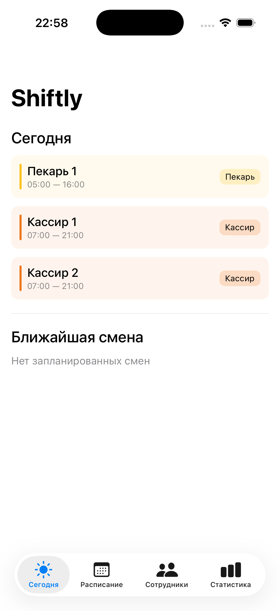
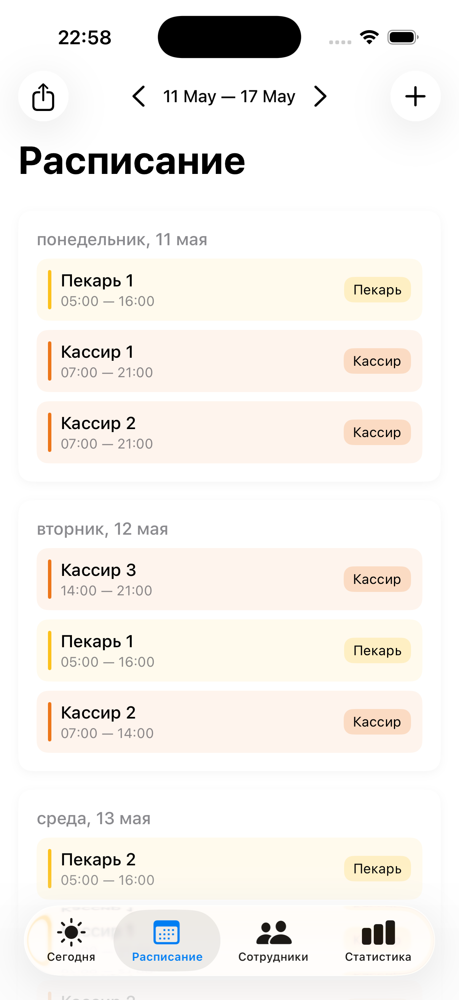
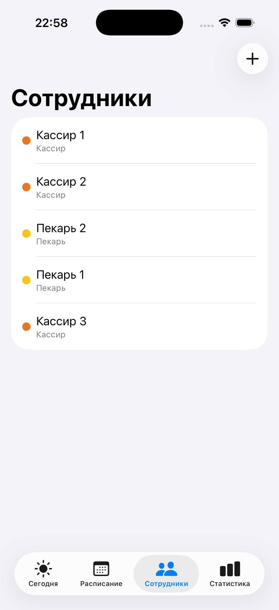
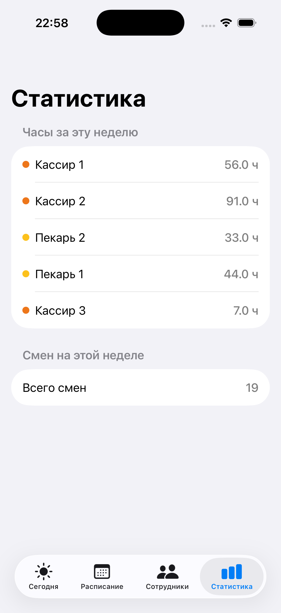

# Shiftly 🥐

Приложение для планирования смен сотрудников в небольшой пекарне. Разработано для iOS как учебный проект в портфолио.

## Скриншоты

| Сегодня | Расписание | Сотрудники | Статистика |
|---|---|---|---|
|  |  |  |  |

## Функционал

- 📅 Расписание смен по неделям с переключением вперёд/назад
- 👥 Управление сотрудниками — добавление, редактирование, удаление
- ➕ Создание смен сразу на несколько дней
- ⚠️ Валидация конфликтов смен
- 📊 Статистика часов по сотрудникам за неделю
- 📤 Экспорт расписания в любой мессенджер
- 🔔 Ежевечернее уведомление о сменах на завтра

## Технологии

- **SwiftUI** — декларативный UI
- **SwiftData** — локальное хранилище данных
- **MVVM** — архитектура приложения
- **UserNotifications** — push-уведомления
- **ShareLink** — экспорт расписания

## Требования

- iOS 17+
- Xcode 15+

## Установка

```bash
git clone https://github.com/PinkPoony/Shiftly.git
cd Shiftly
open Shiftly.xcodeproj
```

## Автор
 
GitHub: [@PinkPoony](https://github.com/PinkPoony)
